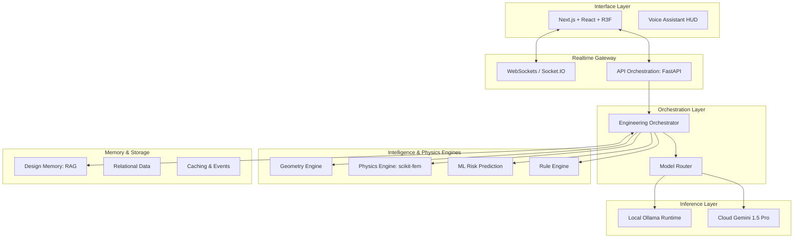

# System Integration Architecture: Antiogravity Engineering Intelligence Platform

## 1. Integration Vision

The goal is to build a **Unified Engineering Intelligence Operating System**. Every subsystem—geometry, physics, reasoning, and memory—is integrated into a singular orchestration layer, providing a consistent engineering context for both human and AI agents.

---

## 2. Full Production Architecture

---

## 3. Core Integration Layers

| Layer               | Purpose                   | Technology Stack                |
| :------------------ | :------------------------ | :------------------------------ |
| **Frontend**        | Unified UI & 3D Rendering | Next.js, R3F, Tailwind, Zustand |
| **API Integration** | Service Coordination      | FastAPI, Pydantic, JWT          |
| **AI Integration**  | Model Orchestration       | Ollama, Gemini, DSPy            |
| **Geometry**        | CAD Intelligence          | Trimesh, Voxel-based MeshHex    |
| **Physics**         | High-Fidelity FEM         | Scikit-fem, Scipy               |
| **Realtime**        | Streaming & Events        | WebSockets, Socket.IO           |
| **Memory**          | Engineering Continuity    | Qdrant, PostgreSQL, Redis       |
| **Observability**   | Monitoring & Tracing      | Grafana, Prometheus, LangSmith  |

---

## 4. Engineering Orchestrator Integration

The **Central Brain** coordinates the following data flow:

1. **Geometry Analysis**: `geometry = await self.geometry_engine.process(file)`
2. **Physics Evaluation**: `physics = await self.physics_engine.evaluate(geometry)`
3. **ML Risk Prediction**: `risk = await self.ml_engine.predict(geometry, physics)`
4. **AI Reasoning**: `reasoning = await self.llm_engine.reason(geometry, physics, risk, query)`

---

## 5. Physics & Simulation Integration

Physics results are injected as deterministic grounding for the AI.

- **Stress Calculation**: $\sigma = F/A$ (Symbolic) + FEM (Deterministic)
- **Deflection**: $\delta = FL^3/3EI$ (Symbolic) + FEM (Deterministic)
- **Pipeline**: CAD $\rightarrow$ Voxel Mesh $\rightarrow$ Boundary Conditions $\rightarrow$ Sparse Solver $\rightarrow$ Heatmap Results.

---

## 6. Ollama Integration (Local AI)

Model routing optimizes for task complexity and privacy:

- **Reasoning**: `Llama 3` (Local) / `Gemini` (Cloud)
- **Extraction**: `Qwen 2.5`
- **Coding**: `DeepSeek-Coder`
- **Fast Tasks**: `Mistral`

---

## 7. Realtime & Voice Integration

- **WebSockets**: Real-time event streaming for `simulation.progress`, `ai.reasoning.chunk`, and `cad.updated`.
- **Voice Pipeline**: Hands-free interaction via `Faster-Whisper` (STT) $\rightarrow$ `Engineering NLP` $\rightarrow$ `Ollama/Gemini` $\rightarrow$ `Piper/Browser TTS`.

---

## 8. Event-Driven & Worker Architecture

Heavy engineering tasks are offloaded to background workers.

- **Event Stack**: Kafka/RabbitMQ for high-throughput engineering events.
- **Background Tasks**: Celery/Redis for FEM solving and mesh generation.
- **Distributed Compute**: Ray for parallel physics simulations.

---

## 9. Production Deployment

- **Containerization**: Docker-based microservices.
- **Orchestration**: Kubernetes for scaling GPU and Simulation workers.
- **GPU Serving**: RunPod / BentoML for local and cloud inference.

---

## 10. Final Integration Philosophy

The Antiogravity platform is not a collection of tools; it is a **unified engineering intelligence operating system** capable of understanding, simulating, and reasoning about the real world.
